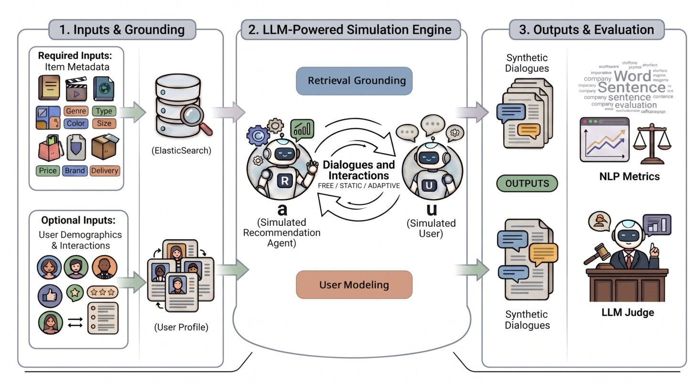

# OmniSim: Conversational Recommendation Dialogue Simulator


[](https://dl.acm.org/doi/10.1145/3774935.3812730)

OmniSim generates realistic, personalised, multi-turn conversational recommendation dialogues from item metadata alone.  It combines LLM-based generation with Elasticsearch-grounded retrieval to mitigate hallucination and produces human-level lexical diversity across any item domain (movies, fashion, e-commerce, …).

**GitHub:** https://github.com/irecsys/OmniSim

**Demo:** http://34.72.93.183/ (only available till June 14, 2026)



---

## Features

- **Domain-agnostic** — works with any item metadata CSV; no domain-specific templates required
- **Retrieval-grounded** — hybrid BM25 + dense kNN scoring (Equations 3–6 in the paper) prevents hallucination and data leakage
- **Three dialogue modes** — Free (open-ended), Static (schema-driven), Adaptive (LLM-augmented attributes)
- **Hybrid user modelling** — combines short-term and long-term preference signals when interaction history is available
- **Probabilistic behaviours** — configurable chit-chat, explainable rejections, recommendation explanations
- **Dual-track evaluation** — NLP lexical-diversity metrics + LLM-as-a-Judge quality scores
- **Streamlit dashboard** — interactive browser for generated conversations and evaluation results

---

## Project Structure

```
OmniSim/
├── run.py                    # Main entry point — run simulations
├── build_index.py            # Build / rebuild the Elasticsearch index
│
├── configs/
│   ├── system/
│   │   └── system.yaml       # Global defaults (all parameters documented)
│   ├── imdb/
│   │   ├── imdb.yaml         # IMDB movies dataset config
│   │   └── inputs/           # test_pairs.csv, test_items.csv, test_users.csv
│   ├── hm/
│   │   ├── hm.yaml           # H&M fashion dataset config
│   │   └── inputs/           # test_pairs.csv, test_items.csv, test_users.csv
│   └── prompts/
│       ├── default.yaml      # All LLM prompt templates (editable)
│       └── phrase_templates.yaml
│
├── data/
│   ├── imdb/                 # items.csv (with embedding_vector), users.csv, interactions.csv
│   └── hm/                   # handm.csv (with embedding_vector), users.csv, interactions.csv
│
├── utils/
│   ├── utils.py              # Scoring, retrieval, LLM clients, dialogue acts
│   ├── simulator.py          # Free / Static / Adaptive simulation engines
│   ├── quick_start.py        # Orchestrator — parallel conversation generation
│   ├── configurator.py       # Config loader
│   ├── dataset.py            # CSV loader
│   ├── user_profile_builder.py  # Build / cache user preference profiles
│   ├── evaluator.py          # LLM-as-a-Judge evaluation
│   └── metrics.py            # NLP lexical diversity metrics
│
├── scripts/
│   ├── build_es_index.py     # Index items into Elasticsearch
│   ├── compute_nlp_metrics.py
│   └── run_judge_all.py
│
├── UI/
│   └── dashboard.py          # Streamlit analytics dashboard
│
└── docs/
    └── API.md                # Full API reference
```

---

## Requirements

- Python 3.10+
- Elasticsearch **8.x** (local via Docker or remote; do **not** use ES 9.x)
- An OpenAI-compatible LLM API — Azure OpenAI, OpenAI, ThetaEdgeCloud, or any vLLM-compatible endpoint
- An embeddings API or local `sentence-transformers` (runs offline, free)

---

## Installation

```bash
# 1. Clone the repository
git clone https://github.com/irecsys/OmniSim.git
cd OmniSim

# 2. Create and activate a virtual environment
python -m venv .venv
source .venv/bin/activate        # Windows: .venv\Scripts\activate

# 3. Install dependencies
pip install -r requirements.txt

# 4. Copy the environment template and fill in your credentials
cp .env.example .env
# Edit .env — see "API Keys" section below
```

> **Note — `elasticsearch` client version:** `requirements.txt` pins
> `elasticsearch>=8.13.0,<9.0.0`.  The 9.x client is **incompatible** with
> an ES 8.x server and will produce `BadRequestError(400)`.

---

## API Keys (`.env`)

Copy `.env.example` to `.env` and fill in the keys for the providers you use:

```dotenv
# OpenAI (chat + embeddings)
OPENAI_KEY=sk-...

# Azure OpenAI (chat + embeddings — same key for both)
AZURE_KEY=...

# ThetaEdgeCloud (open-source models via hosted API)
THETA_KEY=...

# Elasticsearch — only needed when xpack.security.enabled=true
ES_USER=elastic
ES_PWD=...
```

---

## Setup

### Step 1 — Start Elasticsearch 8.x

```bash
# Docker (recommended — security disabled for local use)
docker run -d --name es8 \
  -e "discovery.type=single-node" \
  -e "xpack.security.enabled=false" \
  -p 9200:9200 \
  docker.elastic.co/elasticsearch/elasticsearch:8.13.0

# Verify
curl http://localhost:9200
```

### Step 2 — Configure your LLM provider

Edit `configs/system/system.yaml`.  Choose **one** of the options below:

```yaml
# ── Option A: Azure OpenAI (recommended) ─────────────────────
openai_provider: azure
chat_model: gpt-4o-mini          # deployment name in your Azure resource
chat_endpoint: https://YOUR_RESOURCE.openai.azure.com/
chat_api_version: "2024-02-01"

embeddings_provider: azure
embeddings_model: text-embedding-3-small
embeddings_endpoint: https://YOUR_RESOURCE.openai.azure.com/
embeddings_api_version: "2024-02-01"

# ── Option B: OpenAI ──────────────────────────────────────────
openai_provider: openai
chat_model: gpt-4o-mini

embeddings_provider: openai
embeddings_model: text-embedding-3-small

# ── Option C: ThetaEdgeCloud (Llama) + local embeddings ──────
# Use num_workers: 1 to avoid 409 Conflict (no concurrent requests)
openai_provider: thetaedgecloud
chat_model: meta-llama/Meta-Llama-3.1-70B-Instruct

embeddings_provider: sentence-transformers   # free, runs offline
embeddings_model: all-MiniLM-L6-v2
```

> **ThetaEdgeCloud note:** the API does not support concurrent requests.
> Always run with `--num-workers 1` when using this provider.

### Step 3 — Build the Elasticsearch index

Both built-in datasets ship with **pre-computed embeddings** — no API calls
are needed at index-build time:

- `data/imdb/items.csv` → `embedding_vector` column (dim 1536)
- `data/hm/handm.csv`  → `embedding_vector` column (dim 1536)

```bash
# IMDB movies
python run.py --config configs/imdb/imdb.yaml --build-index

# H&M fashion
python run.py --config configs/hm/hm.yaml --build-index
```

---

## Running Simulations

```bash
# All enabled strategies, default mode (set in system.yaml)
python run.py --config configs/imdb/imdb.yaml

# Override dialogue mode
python run.py --config configs/imdb/imdb.yaml --mode adaptive

# One specific strategy
python run.py --config configs/imdb/imdb.yaml --strategy user_item_pairs

# Quick smoke-test: 2 pairs, 1 conversation each, serial execution
python run.py --config configs/imdb/imdb.yaml \
  --pairs-file configs/imdb/inputs/test_pairs.csv \
  --chats-per-entry 1 --num-workers 1

# Override parallel workers
python run.py --config configs/imdb/imdb.yaml --num-workers 4
```

Generated conversations are saved to:
```
chats/{dataset}/{mode}/{strategy}/{run_timestamp}/
  {user_id}-{item_id}-{turns}-{attempts}-{succeed}-{timestamp}.txt
```

`succeed=1` means the target item was successfully recommended and accepted.

---

## Dialogue Modes

| Mode | Description | Best for |
|---|---|---|
| `free` | User describes preferences in open natural language | Maximum diversity |
| `static` | Bot asks about predefined metadata attributes (genre, language, …) | Slot-filling systems |
| `adaptive` | Like static, but bot also discovers additional relevant attributes via LLM | Most realistic |

Set `mode_refinement` in `system.yaml` or pass `--mode` at runtime.

---

## Scoring Formula 

**Base retrieval score:**

**Note that we added BM25 score, where our UMAP'26 paper utilized cosine similarity only.
All scores are normalized before computations in linear weighted formula.**

```
S̃_base(q, i) = λ · S̃_BM25(q, M_i,d) + (1 − λ) · S̃_cos(q, i)
```

**Hybrid score with user profile:**

```
S̃_hybrid = α · S̃_base + (1 − α) · [β · S̃_cos(i, p_short) + (1 − β) · S̃_cos(i, p_long)]
```

**Threshold gate:** if `max(S̃_base) < τ` across all retrieved candidates, the system stays in preference-elicitation mode and asks another clarifying question instead of recommending.

| Parameter | Default | Meaning |
|---|---|---|
| `lambda_bm25` | 0.3 | λ — BM25 vs cosine balance |
| `weight_es_score` | 0.7 | α — retrieval vs user-profile weight |
| `weight_user_taste_short` | 0.3 | β — short-term vs long-term preference ratio |
| `threshold_similarity` | 0.3 | τ — minimum `max(S̃_base)` to trigger recommendation |

---

## Evaluation

### NLP Metrics

```bash
python scripts/compute_nlp_metrics.py \
  --folder chats/imdb/adaptive \
  --output results/adaptive_metrics.csv
```

### LLM-as-a-Judge

```bash
python scripts/run_judge_all.py \
  --folder chats/imdb/adaptive/user_item_pairs/ALL \
  --output results/judge_adaptive.csv \
  --limit 50
```

### Dashboard

```bash
streamlit run UI/dashboard.py --server.port 8501 --server.address 0.0.0.0
```

Open `http://localhost:8501` in your browser.

---

## Analytics Dashboard

OmniSim ships with a Streamlit dashboard for exploring generated conversations
and comparing dialogue modes side-by-side.

**Install dashboard dependencies** (if not already installed):

```bash
pip install streamlit>=1.32.0 plotly>=5.18.0
```

**Launch:**

```bash
streamlit run UI/dashboard.py
# or with explicit host/port:
streamlit run UI/dashboard.py --server.port 8501 --server.address 0.0.0.0
```

Open `http://localhost:8501` in your browser.

**What you can explore:**

| Panel | Description |
|---|---|
| Conversation Browser | Read any generated `.txt` file directly in the browser |
| Success Rate | Per-mode success rates and recommendation attempt distributions |
| Turn Statistics | Average turns, question counts, chit-chat frequency |
| NLP Metrics | Distinct-1/2, TTR, MTLD, HDD — compare Free vs Static vs Adaptive |
| LLM Judge Scores | Fluency, Conversational Quality, Content Quality (1–5 scale) |

The dashboard reads from the `chats/` folder produced by `run.py`.  Point it
at any run subfolder after a simulation completes.

---

## Using Your Own Data

1. Prepare `items.csv` with at minimum: an ID column, a title column, and a descriptive text column.
2. Optionally add `users.csv` (demographics) and `interactions.csv` (ratings) to enable personalisation.
3. Copy `configs/imdb/imdb.yaml` to `configs/mydata/mydata.yaml` and update:
   - `es_index`, `dataset`
   - `col_itemid`, `col_title`, `col_category`, `col_details`
   - `embedding_fields`, `item_attributes` (BM25 uses the auto-built `bm25_details` field)
   - `role_user`, `role_bot`
4. Build the index: `python run.py --config configs/mydata/mydata.yaml --build-index`
5. Run: `python run.py --config configs/mydata/mydata.yaml`

> If your `items.csv` does **not** have a pre-computed embedding column, set
> `precomputed_embedding_col: ~` in your dataset config.  OmniSim will compute
> embeddings via the configured `embeddings_provider` at index-build time.

---

## Citation

**If you use OmniSim in your research, please cite our paper below:**

```bibtex
@article{zheng2026omnisim,
  title   = {OmniSim: A LLM-Powered Open-Source Simulator for Generating Personalized 
  and Adaptive Conversational Recommendation Dialogues},
  author  = {Zheng, Yong and Zhang, Jian},
  journal = {Proceedings of the 34th ACM Conference on User Modeling, Adaptation and Personalization (UMAP)},
  year    = {2026}
}
```

---

## License

Apache 2.0 — see [LICENSE](LICENSE).
